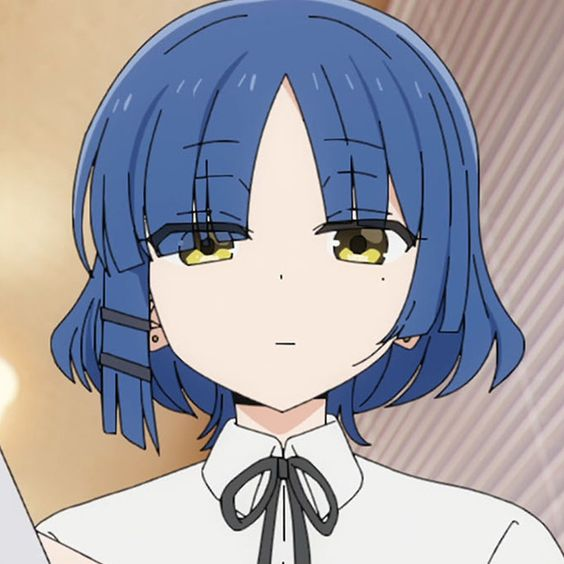

# Ryo-Yamada-bot

Ryo Yamada Bot is a Telegram bot designed to provide a variety of 
functionalities, including sending both **NSFW** (Not Safe for Work) 
and **SFW** (Safe for Work) images, replying to messages, 
and continuously updating its functionality.

## Features

- Image Sending: Ryo Yamada Bot can send both NSFW and SFW images upon request. It provides a diverse collection of images to cater to different preferences.
- Message Reply: The bot is capable of replying to messages sent by users. It uses natural language processing techniques to generate relevant and contextually appropriate responses.
- Continuous Functionality Updates: Ryo Yamada Bot is regularly updated to introduce new features and improve existing ones. This ensures that users have access to the latest functionalities and a seamless experience.

## Getting Started

To use Ryo Yamada Bot, follow these steps:

1. Search for "Ryo Yamada Bot" on Telegram or click here to access the bot directly.
2. Start a conversation with the bot by clicking the "Start" button or sending a message.
3. To request an image, use the appropriate command. For NSFW images, use /nsfw, and for SFW images, use /sfw.
4. If you want to engage in a conversation with the bot, simply send a message, and it will reply accordingly.

## Disclaimer

Please note that the NSFW images provided by Ryo Yamada Bot may not be suitable for all audiences. 
We encourage users to exercise discretion and ensure that the content is appropriate for their intended audience.
